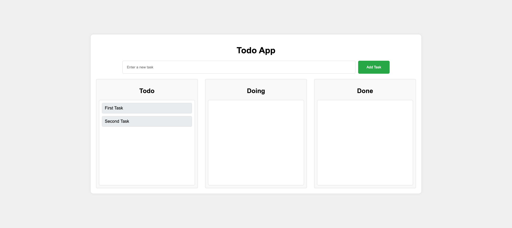

# Drag-and-Drop Todo App

A sleek and interactive Todo App built with JavaScript, HTML, and CSS. This app features a drag-and-drop interface for managing tasks across three stages: 'Todo', 'Doing', and 'Done'. Easily add tasks with an input field and move them between stages with a smooth drag-and-drop experience. Perfect for staying organized and enhancing productivity!



## Features

- **Add Tasks**: Input field with a submit button to add new tasks.
- **Drag and Drop**: Move tasks between 'Todo', 'Doing', and 'Done' columns with drag-and-drop functionality.
- **Real-time Updates**: The app updates task positions in real-time as you drag and drop them.

## Demo

Check out the live demo [here](#).

## Installation

1. Clone the repository:

   ```bash
   git clone https://github.com/yourusername/todo-app.git
   ```

2. Navigate to the project directory:

   ```bash
   cd todo-app
   ```

3. Open the `index.html` file in your browser to run the app.

## Usage

1. **Adding a Task**: Enter the task description in the input field and click the 'Add Task' button or press Enter.
2. **Dragging and Dropping**: Click and hold on a task to drag it. Move it to the desired column ('Todo', 'Doing', 'Done') and release the mouse button to drop it.

## Technologies Used

- HTML
- CSS
- JavaScript

## Screenshot


## Contributing

1. Fork the repository.
2. Create your feature branch (`git checkout -b feature/YourFeature`).
3. Commit your changes (`git commit -m 'Add some feature'`).
4. Push to the branch (`git push origin feature/YourFeature`).
5. Open a Pull Request.

## License

This project is licensed under the MIT License - see the [LICENSE](LICENSE) file for details.

## Acknowledgments

- Inspired by various drag-and-drop task management applications.
